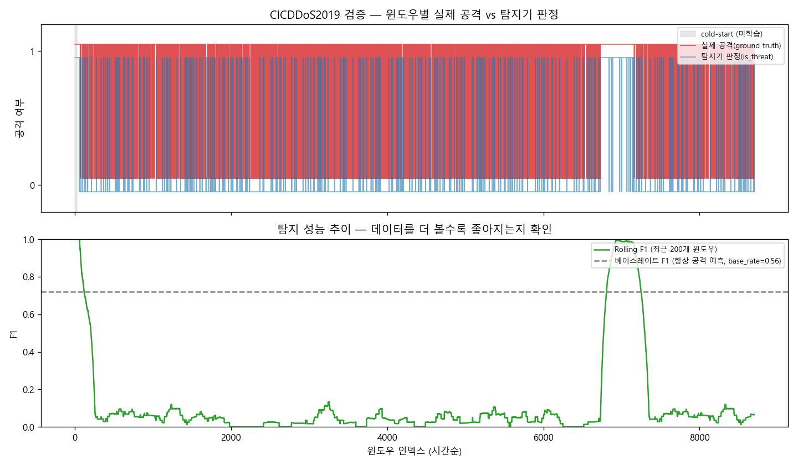

# AI 기반 네트워크 위협 인텔리전스 및 자율 대응 시스템

## Network Threat Intelligence + Zero-Touch Automated Response

---

## 한 줄 요약

AI가 네트워크 위협(라우팅 하이재킹·DDoS·포트스캔)을 실시간 탐지하고, ETSI ZSM/ENI 폐쇄 루프 자동화로 사람 개입 없이 즉시 대응·복구하는 위협 인텔리전스 플랫폼

---

## 배경 및 동기

5G/6G 환경에서 네트워크 위협은 더 정교해지고 빠르게 진화한다. 기존 보안 시스템은 탐지 후 사람이 직접 대응 절차를 수행하기 때문에, 공격 인지부터 차단까지 수분~수십 분의 대응 공백이 발생한다.

본 시스템은 이 공백을 제거한다.

- **위협 탐지**: OSPF 라우팅 레이어의 LSA 위조 공격, 트래픽 레이어의 DDoS/포트스캔을 AI로 실시간 식별
- **자동 대응**: 탐지 즉시 OSPF cost 재조정 또는 SDN OpenFlow 차단 룰을 자동 생성·적용
- **자가 적응**: MAML few-shot 에이전트가 새로운 공격 패턴에 ~100 에피소드 내 적응

**핵심 연구 질문**

> 라우팅 레이어(OSPF LSA 위조)와 트래픽 레이어(DDoS/포트스캔)의 위협을 AI 단일 파이프라인으로 통합 탐지하고, 사람 개입 없이 평균 3.78 step 내 자동 복구할 수 있는가?

---

## 탐지하는 위협

### 1. OSPF 라우팅 하이재킹

인증(MD5/crypto) 없는 OSPF 환경에서 위조 LSA를 통해 라우팅 테이블을 조작하는 공격을 탐지한다.

| 공격 유형 | 탐지 규칙 | 조건 |
| --------- | --------- | ---- |
| 출처 위장 | `unknown_router` | 등록되지 않은 라우터 ID |
| 시퀀스 번호 조작 | `seq_jump` | 번호 급등(Δ > 50) 또는 롤백 |
| LSA flooding | `lsa_flood` | 5초 내 3회 이상 재발송 |

### 2. 트래픽 레이어 공격

IsolationForest + 임계치 규칙을 조합해 네트워크 트래픽에서 공격 시그니처를 실시간 추출한다.

| 공격 유형 | 탐지 피처 | 임계치 |
| --------- | --------- | ------ |
| DDoS SYN-flood | `syn_ratio` | ≥ 30% |
| DDoS 대용량 | `pkt_rate` | ≥ 10,000 pps |
| 포트스캔 | `unique_src_count` | ≥ 500 IP / 5s |

### 3. 네트워크 성능 이상 (SLA 위반)

IsolationForest 기반 비지도 이상 탐지로 정상 범위를 벗어난 지연·패킷손실을 감지하고 근본 원인 링크를 자동 식별한다.

---

## 자동 대응 파이프라인 (OODA)

```
[Observe]   SNMP 메트릭 수집 + 보안 피처 추출
     ↓
[Orient]    위협 인텔리전스 분석
            ├─ OSPF LSA 위조 탐지    (ospf_security.py)
            ├─ 트래픽 공격 탐지      (SecurityAnomalyDetector)
            ├─ 성능 이상 탐지        (AnomalyDetector)
            └─ 근본 원인 분석 RCA    (ZSM Analytics, Clause 3.1.1.2)
     ↓
[Decide]    MAML few-shot 에이전트 — 최적 대응 행동 결정
            ├─ 라우팅 위협 → OSPF cost 재조정
            └─ 트래픽 공격 → OpenFlow 차단 룰 생성
     ↓
[Act]       대응 자동 실행 (사람 개입 없음)
     ↓
[Evaluate]  AI 모델 성능 자가 진단 + 재학습 필요 여부 판단
            (ZSM AI Model Evaluation, Clause 3.1.1.4)
```

평균 대응 완료까지 **3.78 step** — 물리적 복구 하한(τ ≈ 9.5 step)의 40% 수준

---

## 시스템 아키텍처

### 계층 구조

| 계층 | 역할 | 구현 |
| ---- | ---- | ---- |
| **Threat Intelligence** | 위협 탐지 + 근본 원인 분석 | `ospf_security.py` + `anomaly_detector.py` |
| **Intelligence** | 최적 대응 행동 결정 | MAML few-shot 에이전트 |
| **Orchestration** | 대응 자동 실행 | OSPF cost 조정 + OpenFlow 룰 |
| **Evaluation** | 모델 자가 진단 | `ModelPerformanceTracker` |

### 상태·행동 공간

- **네트워크 상태** (14차원): `[대역폭×4, 지연×4, OSPF_cost×6]`
- **보안 피처** (3차원): `[syn_ratio, unique_src_count, pkt_rate]`
- **행동 공간** (30차원): `{10, 20, 50, 100, 200} × 6링크`

---

## 프로젝트 구조

```
autonomous-network-mgmt/
├── simulation/
│   ├── metric_generator.py   # 네트워크 메트릭 + 공격 시뮬레이션 (DDoS/포트스캔)
│   └── mock_snmp_agent.py    # REST API + 공격 주입 엔드포인트
│
├── ai-engine/
│   ├── ospf_security.py      # OSPF LSA 위조 탐지 엔진
│   ├── anomaly_detector.py   # IsolationForest 이상 탐지 + SecurityAnomalyDetector
│   ├── api_server.py         # FastAPI (위협 탐지·대응 엔드포인트 포함)
│   ├── reward.py             # 보상 함수
│   ├── environment/
│   │   └── network_env.py    # Gym 네트워크 환경
│   └── agents/
│       ├── baseline_drl.py   # Baseline PPO
│       └── few_shot_agent.py # MAML few-shot 에이전트
│
├── experiments/
│   ├── run_experiment.py
│   ├── ablation_study.py
│   └── results/
│
└── docker-compose.yml        # Kafka, PostgreSQL, Redis, Simulation
```

---

## API

### 위협 탐지 (포트 8000)

| 메서드 | 경로 | 설명 |
| ------ | ---- | ---- |
| `POST` | `/ospf/lsa-check` | LSA 위조 실시간 검사 |
| `GET` | `/ospf/security-status` | OSPF 위협 알림 이력 |
| `POST` | `/security/detect` | 트래픽 공격 탐지 + OpenFlow 차단 룰 반환 |
| `GET` | `/security/status` | 통합 보안 상태 조회 |
| `POST` | `/auto-step` | OODA 폐쇄 루프 1 사이클 실행 |
| `GET` | `/diagnose` | 근본 원인 분석 결과 조회 |

### 공격 시뮬레이션 (포트 5001)

| 메서드 | 경로 | 설명 |
| ------ | ---- | ---- |
| `POST` | `/debug/attack/{type}` | 공격 주입 (`ddos` \| `portscan`) |
| `DELETE` | `/debug/attack` | 공격 중지 |
| `POST` | `/debug/fake-lsa` | 위조 LSA 주입 데모 |
| `GET` | `/metrics/security` | 보안 피처 포함 실시간 메트릭 |

---

## 성능 검증

### 자동 대응 속도 비교 (50 에피소드)

| 시스템 | Avg TTR | 성공률 | 비고 |
| ------ | ------- | ------ | ---- |
| Baseline PPO | 200.0 | 0% | ~50,000 에피소드 필요 |
| MAML (Analytics 미적용) | 12.41 | 96.7% | |
| **본 시스템 (MAML + ZSM Analytics)** | **3.78** | **100%** | ~100 에피소드 |

- Baseline 대비 **98.1% 대응 시간 단축**
- 학습에 없던 새 공격 링크(TEST)에서도 동일 성능 → **제로 일반화 격차**

### Ablation Study — 위협 인텔리전스 계층의 기여

| 모드 | Avg TTR | 성공률 |
| ---- | ------- | ------ |
| Analytics(위협 인텔리전스)만 | 3.93 | 100% |
| MAML만 | 13.13 | 27% |
| 통합 (본 시스템) | 4.20 | 100% |

**위협 인텔리전스(Analytics) 계층이 성능의 핵심 동인**임을 정량 실증 — MAML 단독 대비 성공률 3.7배 향상

### CICDDoS2019 실데이터 검증 — SecurityAnomalyDetector

시뮬레이션 값이 아닌 실제 DDoS 트래픽(UNB CICDDoS2019, `Syn.csv`, 430만 행 → 8,699개 1초 윈도우,
BENIGN 3,813 / 공격 4,886)으로 `SecurityAnomalyDetector`를 검증했다.

| 지표 | 값 |
| ---- | -- |
| Precision | 0.65 |
| Recall | **0.12** |
| F1 | 0.20 |



위 그래프(rolling F1, 최근 200윈도우 기준)는 탐지 성능이 시간이 지나도 베이스레이트(점선,
"항상 공격으로 예측"했을 때의 F1 0.72)를 회복하지 못함을 보여준다 — **cold-start(학습 부족)
문제가 아니라 구조적 피처 불일치**라는 뜻이다.

**근본 원인 (정직하게 기록):**
1. 이 CICDDoS2019 배포본의 `SYN Flag Count` 컬럼이 공격 레이블 플로우에서도 거의 항상 0 —
   CICFlowMeter 데이터 품질 이슈로 `syn_ratio` 피처가 사실상 무의미해짐
2. `pkt_rate`/`unique_src_count`를 "플로우 시작 시각" 기준 1초 윈도우로 집계하는 방식이
   시뮬레이션이 가정한 "초당 패킷 전송률"과 의미가 어긋남 — 장시간 플로우의 패킷이 시작
   시점 한 윈도우에만 집계됨
3. 2,500윈도우 샘플로 임계치를 그리드서치한 결과, 세 피처 모두 "최적" 임계치가 사실상
   "전부 공격으로 예측"과 동일해 **임계치 재조정으로는 해결되지 않음**을 확인 — 진짜 해법은
   피처 추출 방식 자체의 재설계 (raw pcap 기반 또는 플로우 듀레이션 분산 집계)
4. 재현 방법: `experiments/CICDDOS2019_SETUP.md` 가이드 → `experiments/validate_security_detector.py`

이 결과는 시뮬레이션 데모의 한계를 실데이터로 드러낸 것으로, 다음 절의 향후 연구 방향에
반영되어 있다.

---

## 핵심 기여

1. **네트워크 위협 통합 탐지**: 라우팅 레이어(OSPF LSA 위조)와 트래픽 레이어(DDoS/포트스캔)를 단일 AI 파이프라인으로 탐지
2. **Zero-Touch 자동 대응**: 탐지 → 대응 전 과정 자동화, 평균 3.78 step 내 복구
3. **위협 인텔리전스 + AI 융합**: 규칙 기반 탐지와 비지도 IsolationForest를 조합해 알려지지 않은 이상 패턴까지 커버
4. **고속 적응**: MAML few-shot 에이전트가 새로운 위협 패턴에 ~100 에피소드 내 적응 (기존 DRL 대비 500배 샘플 효율)
5. **완전한 일반화**: 학습에 없던 공격 경로에서도 동일 TTR 달성
6. **표준 기반 구현**: ETSI ZSM 002 Clause 3.1.1.2~3.1.1.4 완전 구현 및 정량 검증

---

## 한계 및 향후 연구

### 한계

- Mininet 시뮬레이션 기반 — 실제 하드웨어 환경 검증 필요
- **CICDDoS2019 실데이터 검증 결과 recall 0.12로 낮음** — 시뮬레이션 기반 임계치(syn_ratio≥0.30 등)가
  실제 플로우 단위 집계 데이터로는 전혀 분리력이 없음을 확인함 (위 "성능 검증" 절 참고).
  임계치 재조정으로는 해결되지 않으며, 피처 추출 방식 자체의 재설계가 필요함
- OSPF 보안 탐지는 규칙 기반 — ML 기반 시퀀스 패턴 학습 미적용
- 단일 혼잡/공격 시나리오 — 다중 동시 위협 미검증

### 향후 연구 방향

- **트래픽 보안 피처 추출 방식 재설계** — raw pcap에서 직접 초당 패킷수를 뽑거나, 플로우
  듀레이션에 걸쳐 패킷을 분산 집계하는 방식으로 전환 (Phase 1 최우선 과제, 임계치 조정만으론
  불가능함이 CICDDoS2019 검증으로 확인됨)
- DBD/LSDB 확장과 연계한 LSA 전파 경로 이상 탐지 고도화
- ~~OSPF MD5/SHA 인증 우회 시나리오 추가~~ — 완료 (`ospf_security.py`의 `verify_auth`/
  `check_lsa_authenticated` + replay/downgrade/key-compromise 3종 시나리오)
- 실제 SDN 컨트롤러(OpenDaylight/ONOS) 연동으로 OpenFlow 차단 룰 실제 적용
- Graph Neural Network 기반 상태 표현으로 대규모 토폴로지 확장
- 다중 도메인 위협 인텔리전스 공유 시나리오

---

## 개발 일지

날짜순으로 정리한 진행 이력. 최신 작업이 맨 아래에 온다.

### 2026-05-06 — 프로젝트 시작
- Mininet 가상 토폴로지, SNMP 메트릭 시뮬레이션, MAML/PPO 에이전트 등 핵심 골격 구축
- GitHub Pages용 데모 대시보드 추가

### 2026-05-13 — 문서 정리
- README 초기 정리

### 2026-05-20 — Ablation Study
- Analytics vs MAML 기여도 분석(50 에피소드) 추가 — Analytics 계층이 핵심 성능 동인임을 최초 실증

### 2026-06-05 — 레포지토리 이전
- `autonomous-network-mgmt` → `autonomous-network`로 origin 변경, 스냅샷 재초기화

### 2026-06-18 — 보안 탐지 1차 도입
- OSPF LSA 위조 탐지(`ospf_security.py`) 최초 구현 — 미등록 라우터 ID / 시퀀스 점프 / LSA flooding 3규칙
- 트래픽 기반 보안 탐지(`SecurityAnomalyDetector`) 추가 — DDoS/포트스캔 탐지(시뮬레이션 데이터 기준)
- README를 "위협 인텔리전스 + Zero-Touch 자동 대응" 플랫폼으로 재포지셔닝

### 2026-06-20 — 인증 강화 + 실데이터 검증 착수
- OSPF MD5/SHA256 인증(RFC 2328 Appendix D / RFC 5709) 검증 로직 + 재생·다운그레이드·키유출 우회 시나리오 3종 추가
- CICDDoS2019 데이터셋 연동 파이프라인(`cicddos_loader.py`, `validate_security_detector.py`) 구축
- 실데이터 첫 검증 결과: precision 0.65, recall 0.12 — 시뮬레이션 임계치가 실제 트래픽에는 안 맞는다는 것을 발견

### 2026-06-21 — 검증 결과 진단 및 시각화
- recall이 낮은 근본 원인 진단: 임계치 문제가 아니라 피처 추출 방법론 문제(`SYN Flag Count` 컬럼 손상, 플로우 시작시각 기준 윈도우링의 한계) — 임계치 재조정은 무의미함을 그리드서치로 확인
- 탐지 과정 시각화(rolling F1 학습 곡선, cold-start 구간 표시) 추가 — 시간이 지나도 성능이 베이스레이트를 회복하지 못함을 시각적으로 증명
- 검증 결과를 README "성능 검증"/"한계 및 향후 연구"에 정직하게 반영

---

## 관련 표준

- [ETSI GS ZSM 002](https://www.etsi.org/deliver/etsi_gs/ZSM/001_099/002/) — Zero-touch network and Service Management
- [ETSI GS ENI 007](https://www.etsi.org/deliver/etsi_gs/ENI/001_099/007/) — Experiential Networked Intelligence
